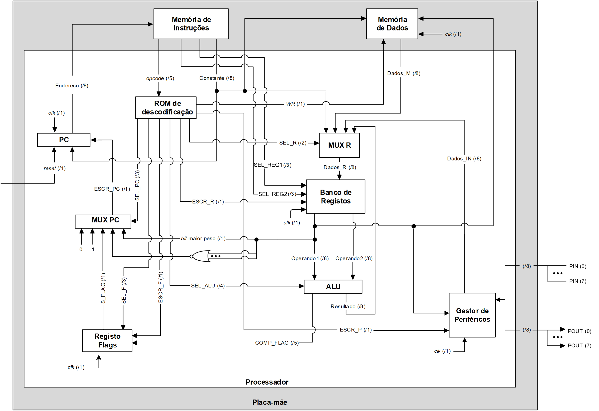

[![MIT License][license-shield]][license-url]
# AC-Project-1-FPGA_CPU
First Project for Subject: Computer Architecture.

This project implements a basic processor with a minimal instruction set using VHDL. The design is developed in Vivado ML Edition, simulated with Vivado Simulator, and tested on an Artix-7 FPGA. The processor operates with 8-bit data and follows the provided block diagram.

## Architecture

### Tasks To-Do

- [ ] Periferals Manager
- [ ] Register MUX
- [x] ~~Register File~~ ✅ 2025-02-27
	- [x] ~~Individual Register~~ ✅ 2025-02-25
	- [x] ~~Register File~~ (Made it with a selector "built in") ✅ 2025-02-25
- [ ] ALU
	- [x] ~~AND, OR, XOR, NOT~~ ✅ 2025-02-25
	- [x] ~~Comparador~~ ✅ 2025-02-25
	- [ ] Somador
	- [x] ~~MUX~~ ✅ 2025-02-25
- [ ] Flag Register
- [ ] Contador do Programa (PC) ??
- [ ] PC MUX
- [ ] Instruction Memory
- [ ] RAM
- [ ] ROM Decoder

[license-url]: https://github.com/JorroIndieDev/AC-Project-1-FPGA_CPU/blob/main/LICENSE
[license-shield]: https://img.shields.io/badge/License-MIT-blue.svg